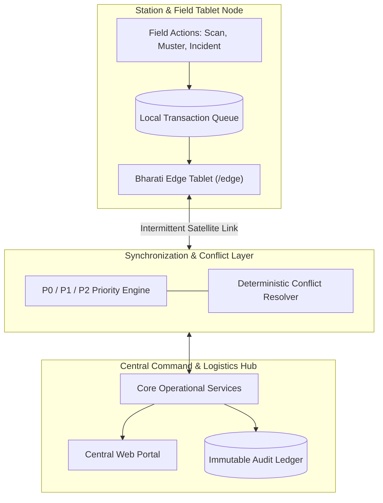

<div align="center">

# DHRUVSETU

**One operational record for polar expeditions.**

DhruvSetu is an offline-first operations platform designed to connect the entire polar expedition lifecycle into a single, unified operational system. Built as an interactive prototype, it links expedition planning, readiness gates, chain-of-custody cargo tracking, station inventories, field sorties, and emergency response into one verifiable record.

[](YOUR_DEMO_URL)
[](https://tanstack.com/start)
[](https://www.typescriptlang.org/)
[](#license)

</div>

---

## Live Demo

[Launch DhruvSetu Demo](YOUR_DEMO_URL)

> **Note**: This is a demonstration environment using synthetic operational data. The application simulates real-world polar operational workflows, connectivity transitions, and multi-master synchronization across edge tablets and central command.

---

## Overview

Polar research expeditions operate under extreme physical isolation, severe weather windows, and unpredictable satellite connectivity. Operational workflows across staging ports, polar vessels, scientific stations, and remote field camps are frequently fragmented across disconnected spreadsheets, paper manifests, and siloed radio logs.

DhruvSetu addresses this fragmentation by establishing **one operational record across the expedition lifecycle**. It connects:

- **People**: Station rosters, team assignments, clearance states, and muster accountability.
- **Cargo**: Chain-of-custody tracking across packing, maritime transport, staging hubs, and station receipt.
- **Stations & Assets**: Living inventories, burn rates, threshold alerts, and machinery maintenance schedules.
- **Field Teams**: Sortie route tracking, periodic radio check-ins, and overdue warnings.
- **Emergency Response**: Instant incident reporting, automated priority queues, and responder coordination.
- **Compliance**: Environmental impact assessments, biosecurity permits, and waste manifests.
- **Connectivity**: Resilient local-first operation that queues updates when disconnected and reconciles changes upon reconnection.

---

## Core Workflow

The diagram below illustrates the end-to-end operational lifecycle managed within the system:


---

## Key Features

### Expedition Readiness

- **Stage Gates**: Track structured milestone gates (Mission Scope, Permits, Cargo, Transit, Station Arrival, Field Operations).
- **Blocker Identification**: Immediate visibility into dependencies preventing deployment.
- **Evidence Tracking**: Quantified requirement completion (e.g., 41 of 50 requirements fulfilled) with direct document references.
- **Expedition Overview**: High-level status across active, planning, and historical seasons.

### Cargo & Custody

- **8-Stage Custody Model**: Complete custody tracking across Demand Raised, Accepted, Packed, Sealed, Dispatched, Cape Town staging, Polar Leg, and Station Delivery.
- **Container & Manifest Control**: Tamper-evident seal tracking and immutable manifest locking with controlled amendment workflows.
- **Exception Logging**: Formal reporting and audit logging for damaged, delayed, or missing items.

### Built for the Edge (Offline-First)

- **Local Operation**: Full CRUD capability while disconnected from central servers.
- **Prioritized Synchronization**: Deterministic queue ordering during intermittent bandwidth windows.
- **Reconnection Replay**: Automatic queue transmission with visual stage progression (Connecting $\rightarrow$ Authenticating $\rightarrow$ Reconciling).

### Personnel & Muster

- **Accountability Roster**: Real-time status tracking (Station, Field, Transit, Unaccounted).
- **Muster Roll-Call**: Fast-action verification interface for emergency station drills and blizzard lock-downs.
- **Medical & Security Clearance**: Clear status indicators for active deployment authorization.

### Field Operations

- **Sortie Management**: Scheduled traverse routes, departure logs, and estimated arrival windows.
- **Check-In Schedules**: Countdown timers for required radio contacts with overdue alerts.
- **Field Team Tracking**: Roster mapping for scientific traverse parties operating away from base.

### Emergency Response

- **Incident Dispatch**: Rapid P0, P1, and P2 incident creation with GPS/sector tagging and casualty counts.
- **Acknowledgement Workflow**: Two-way acknowledgement loop between field tablets and central command.
- **Action Timelines**: Chronological record of responder assignments, mitigation steps, and incident closeout.

### Inventory & Assets

- **Critical Consumables Ledger**: Live stock monitoring for fuel, medical reserves, food rations, and spare parts.
- **Days of Cover Calculations**: Burn rate analysis with threshold-triggered replenishment alerts.
- **Asset Allocation**: Maintenance state and field assignment tracking for snowmobiles, generators, and scientific sensors.

### Synchronization & Conflict Resolution

- **Granular Op States**: Complete visibility across `LOCAL`, `QUEUED`, `TRANSMITTING`, `DELIVERED`, `ACKNOWLEDGED`, `CONFLICT`, `RETRY`, and `FAILED`.
- **Deterministic Conflict Workbench**: Side-by-side inspection of Edge vs. Central record versions with base revision tracking.

### Verifiable Auditability

- **Immutable Event Log**: Append-only log capturing timestamp, operator identity, device ID, action, old state, and new state.
- **Provenance Tracking**: Clear distinction between Central Portal and Field Edge updates.

---

## Built for the Edge

In polar regions, network connectivity is treated as an intermittent operational condition rather than a hard dependency. DhruvSetu implements a local-first operational model:

```
CONNECTED ──► OFFLINE ──► LOCAL OPERATION ──► QUEUED ──► RECONNECT ──► SYNCHRONIZATION
```

### Priority-Based Queue Model

When satellite uplinks become available, DhruvSetu flushes transactions according to operational criticality:

| Priority | Classification             | Operations Handled                                                  |
| :------- | :------------------------- | :------------------------------------------------------------------ |
| **P0**   | **Emergency & Safety**     | Distress alerts, emergency incidents, muster roll-call headcounts   |
| **P1**   | **Operational State**      | Cargo custody updates, physical inventory counts, sortie check-ins  |
| **P2**   | **Background / Telemetry** | Routine audit trail records, non-critical telemetry, completed logs |

> **Architectural Note**: The current repository implements a state simulation of this offline engine in memory and `localStorage` to demonstrate reconciliation, conflict detection, and prioritized sync queues in the browser.

---

## Demonstration Scenario

The interactive prototype is pre-seeded with a comprehensive synthetic operational scenario:

- **Expedition**: 46th Indian Scientific Expedition to Antarctica (46th ISEA 2026-2027)
- **Primary Station**: Bharati Station (Larsemann Hills)
- **Secondary Station**: Maitri Station (Schirmacher Oasis)
- **Staging Hub**: Cape Town Logistics Depot
- **Field Sector**: Field Camp 08 (Glaciology Traverse)
- **Sample Records**:
  - Cargo Package: `C-128` (Precision Ice-Core Drill Head)
  - Container: `CNT-018`
  - Manifest: `M-018`
  - Active Incident: `INC-024` (P0 Crevasse Hazard near Field Camp 08)
  - Active Sortie: `S-024`
  - Field Team: `Team 07`

_All records, personnel names, and tracking IDs in the demo are synthetic._

---

## Demo Walkthrough

Follow this 5-minute walkthrough to experience the key workflows:

1. **Command Center**: Open the main dashboard (`/dashboard`) to view station weather, readiness metrics, inventory cover, and active sorties.
2. **Expedition Readiness**: Navigate to `/expeditions/46th-isea/readiness` and expand Gate 4 (Cargo & Customs) to inspect blocker requirements.
3. **Inspect Cargo**: Open cargo record `C-128` to inspect its custody lifecycle events.
4. **Enter Field Tablet**: Switch to the rugged field interface at `/edge` (`Bharati Edge 01`).
5. **Simulate Network Drop**: Click **Disconnect** on the tablet header to enter simulated offline mode.
6. **Execute Offline Operations**: Perform a stock count or record cargo receipt while offline.
7. **Report an Exception**: Mark cargo item `C-128` as damaged with notes and photos.
8. **Reconnect Tablet**: Click **Reconnect** to trigger the multi-phase synchronization handshake.
9. **Observe Priority Sync**: Watch P0 emergency items sync first, followed by P1 cargo records and P2 logs.
10. **Verify Custody Record**: Check `/cargo` to confirm the exception is reflected in the central ledger.
11. **Track Sorties**: Navigate to `/sorties` and inspect active traverse route `S-024`.
12. **Simulate Emergency**: Create a P0 incident (`INC-024`) from the field interface.
13. **Central Dispatch**: View the incident on the central dashboard, assign a responder, and log mitigation actions.
14. **Conduct Muster**: Open `/muster` to verify personnel safety and log unaccounted team members.
15. **Inspect Conflict Center**: Navigate to `/conflicts` to inspect how concurrent edge and server edits are reconciled.
16. **Review Audit Trail**: Open `/audit` to verify the complete, tamper-evident record of all simulated operations.

---

## Application Modules

```
├── Command
│   ├── Operations Dashboard (/dashboard)
│   └── Notifications & Alerts (/notifications)
├── Expedition
│   ├── Expeditions List (/expeditions)
│   ├── Readiness Gates (/expeditions/$id/readiness)
│   └── Mission Timeline (/timeline)
├── Logistics
│   ├── Cargo Inventory & Detail (/cargo, /cargo/$id)
│   ├── Container Registry (/containers)
│   └── Manifest Control (/manifests)
├── Resources
│   ├── Station Inventory & Ledgers (/inventory)
│   └── Station Assets & Machinery (/assets)
├── People
│   ├── Personnel Roster (/personnel, /personnel/$id)
│   └── Emergency Muster Roll-Call (/muster)
├── Field Operations
│   └── Field Sorties & Traverse Log (/sorties, /sorties/$id)
├── Safety & Response
│   └── Incident Command (/incidents, /incidents/$id)
├── Compliance
│   ├── Environmental Permits (/permits)
│   ├── Environmental Monitoring (/environment)
│   ├── Biosecurity Protocols (/biosecurity)
│   └── Waste Management (/waste)
├── Platform & Edge
│   ├── Rugged Field Tablet (/edge)
│   ├── Synchronization Workbench (/sync)
│   └── Conflict Resolution Center (/conflicts)
└── Audit
    └── Immutable Audit Trail (/audit)
```

---

## Architecture

The diagram below outlines the conceptual system layout connecting the central operational tier with polar edge nodes:



---

## Tech Stack

| Layer               | Technologies                                                                                                        |
| :------------------ | :------------------------------------------------------------------------------------------------------------------ |
| **Framework**       | [TanStack Start](https://tanstack.com/start) & [TanStack Router](https://tanstack.com/router)                       |
| **Core Library**    | [React 19](https://react.dev/) & [TypeScript 5.8](https://www.typescriptlang.org/)                                  |
| **Styling**         | [Tailwind CSS v4](https://tailwindcss.com/) with custom dark navy design system                                     |
| **UI Primitives**   | [Radix UI](https://www.radix-ui.com/), [Command (cmdk)](https://cmdk.paco.me/), [Vaul](https://vaul.emilkowal.ski/) |
| **Animations**      | [Motion](https://motion.dev/) (`motion/react`)                                                                      |
| **Icons & Visuals** | [Lucide React](https://lucide.dev/), [Recharts](https://recharts.org/)                                              |
| **Build & Server**  | [Vite 8](https://vitejs.dev/) with [Nitro](https://nitro.unjs.io/)                                                  |

---

## Project Structure

```
pixel-perfect-view-9723-main/
├── public/                 # Static assets, sitemap, and robots configuration
├── src/
│   ├── components/
│   │   ├── app/            # Shell navigation, search palettes, and record tables
│   │   ├── site/           # Landing page showcase sections (Hero, Features, Architecture)
│   │   └── ui/             # Reusable accessible UI primitives (Dialog, Tabs, Badges)
│   ├── demo/               # Simulated operational engine and backend
│   │   ├── engine.tsx      # React context provider managing clock, connectivity, and sync
│   │   ├── guide.ts       # Guided walkthrough tour definitions
│   │   ├── seed.ts         # Synthetic scenario seed dataset (46th ISEA)
│   │   ├── services.ts     # Domain service selectors and calculated metrics
│   │   └── types.ts        # Typed interfaces for cargo, personnel, sorties, incidents
│   ├── hooks/              # Reusable React hooks
│   ├── lib/                # Utility helpers and error-handling utilities
│   ├── routes/             # TanStack Start file-system routing
│   │   ├── __root.tsx      # Root application shell, providers, and global overlays
│   │   ├── index.tsx       # Marketing and product overview landing page
│   │   ├── edge.tsx        # Rugged field tablet route (Bharati Edge 01)
│   │   ├── _ops.tsx        # Command center shell layout
│   │   └── _ops.*.tsx      # Core operations routes (dashboard, cargo, inventory, etc.)
│   ├── router.tsx          # TanStack Router initialization
│   ├── server.ts           # SSR server entry point
│   ├── start.ts            # TanStack Start runtime configuration
│   └── styles.css          # Tailwind CSS v4 design tokens and theme variables
├── package.json            # Project dependencies and script declarations
├── tsconfig.json           # TypeScript configuration
└── vite.config.ts          # Vite build and plugin setup
```

---

## Getting Started

### Prerequisites

- **Node.js**: Version 20.x or higher
- **Package Manager**: `npm`, `pnpm`, or `bun`

### Installation

Clone the repository and install dependencies:

```bash
git clone <repository-url>
cd pixel-perfect-view-9723-main
npm install
```

### Development Server

Start the local development server:

```bash
npm run dev
```

Open [http://localhost:3000](http://localhost:3000) in your browser.

### Production Build

Create an optimized production build:

```bash
npm run build
npm run preview
```

---

## Environment Variables

No environment variables are required to run the demonstration environment. All operational state and synthetic datasets initialize out-of-the-box.

---

## Demo State

The interactive prototype maintains a fully reactive simulation state stored in the browser's `localStorage` (keyed under `dhruvsetu-demo-state`).

- **Connection Simulation**: Toggle between `CONNECTED`, `OFFLINE`, and `RECONNECTING` at any time.
- **Sync States**: Track individual operations across `LOCAL`, `QUEUED`, `TRANSMITTING`, `DELIVERED`, `ACKNOWLEDGED`, `CONFLICT`, `RETRY`, and `FAILED`.
- **State Reset**: Click the **Simulation Environment** badge in the header or call `actions.reset()` to return to initial seed conditions.

---

## Design Philosophy

- **Operational Clarity**: High-density data layouts optimized for fast scanning without cognitive clutter.
- **Mission-Control Visuals**: Deep abyss navy palette paired with high-visibility accent colors (Teal, Amber, Crimson) for status recognition.
- **Restrained Motion**: Subtle micro-interactions designed to communicate state changes without distracting operators.
- **Keyboard-First Navigation**: Global command search (`Cmd+K` / `Ctrl+K`) for rapid switching between records, containers, and modules.

---

## Responsive Design

The application provides dedicated viewports tailored to distinct operational environments:

- **Central Command Desktop / Laptop**: Multi-column monitoring dashboards, data grids, and complex split-view editors.
- **Rugged Field Tablet (`/edge`)**: Oversized touch targets, high-contrast typography, and simplified workflows designed for gloved operation in polar cargo bays.
- **Mobile Viewport**: Responsive card layouts for quick status checks on handheld devices.

---

## Data & Security Notice

> **Demonstration Disclaimer**: This repository is a prototype demonstration platform. All expedition names, station logs, cargo items, container numbers, sortie routes, personnel rosters, and incident records are completely synthetic and generated for demonstration purposes.

---

## Roadmap

### Current Demonstration

- [x] Complete landing page and operational storytelling
- [x] Command Center overview dashboard with live clock simulation
- [x] 8-stage cargo custody tracker and container manifest locking
- [x] Standalone field tablet interface (`/edge`) with simulated disconnect
- [x] Prioritized P0/P1/P2 synchronization queue
- [x] Interactive Conflict Center with side-by-side reconciliation
- [x] Immutable append-only audit trail
- [x] Expedition readiness gate and blocker tracking
- [x] Sortie tracking, muster roll-call, and emergency incident workflows

### Future Production Work

- [ ] Persistent distributed database backend (e.g., PostgreSQL with local SQLite edge replication)
- [ ] Physical hardware integration for handheld barcode/RFID scanners
- [ ] Hardware-encrypted local storage for field tablets
- [ ] Satellite data compression protocols (e.g., optimized binary deltas over Iridium SBD)
- [ ] Role-based access control (RBAC) and hardware key (FIDO2/WebAuthn) authentication
- [ ] Direct telemetry ingest from station environmental monitoring sensors

---

## Contributing

1. Fork the repository
2. Create your feature branch (`git checkout -b feature/operational-enhancement`)
3. Commit your changes (`git commit -m 'Add support for secondary station telemetry'`)
4. Push to the branch (`git push origin feature/operational-enhancement`)
5. Open a Pull Request

---

## License

License information will be added before public distribution.

---

<div align="center">

**DHRUVSETU**

_One operational record for polar expeditions._

Plan · Move · Operate · Respond

</div>
